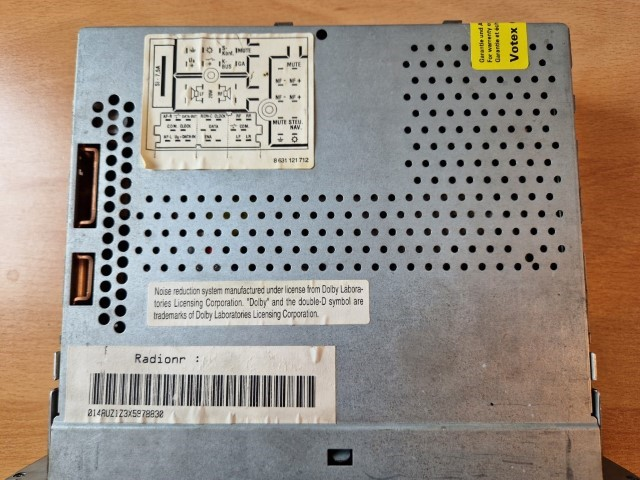
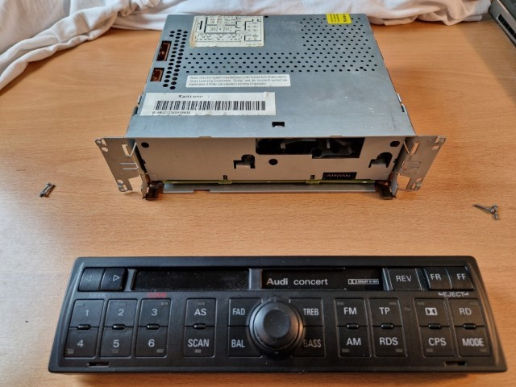
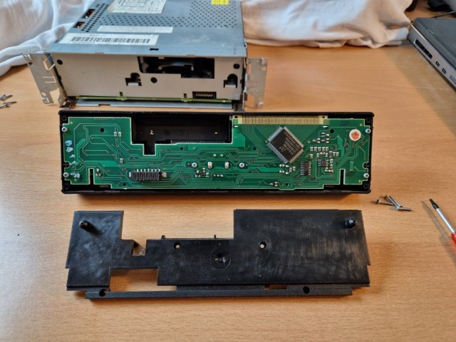
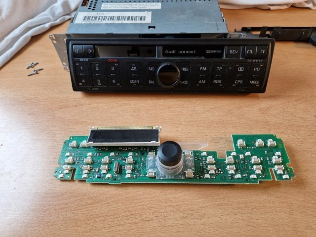

# Fixing My Audi Concert Radio

My Audi Concert radio has two problems: the display shows as good as nothing , and the volume control turns up to full with the slightest touch. After finding some excellent resources online (which I don't want to withhold from you).

[Link to Audi TT Club Forum](https://www.audittclub.nl/forum/viewtopic.php?p=23251)

[Link to TT Owners Club Forum - Pixel Errors in Radio Display](https://www.tt-owners-club.net/forum/index.php?thread/43083-pixelfehler-im-radiodisplay/)

[Link to Kovo Blog - Audi Concert/Chorus: Fixing Missing LCD Segments](https://kovo-blog.blogspot.com/2019/08/audi-concertchorus-fixing-missing-lcd.html)

## I've come to the following conclusions:

- **Display Issue**: If the display is defective, it is almost always due to the glued flex cable. If the flex cable is broken, it needs to be replaced. If it looks okay, heating it up can help reactivate the adhesive and possibly fix any poor electrical contact.

- **Volume Control Issue**: The volume control problem is due to the microcontroller's EEPROM. Over time, the EEPROM gets damaged because each volume change writes to the EEPROM (due to a software bug). After 10,000 write operations, the EEPROM cell for the volume setting has trouble retaining the new value (it works better in warm conditions than in cold). If changing the bass or balance causes the same issue, the problem might be with the control itself and not the EEPROM in the microcontroller.

- **Code Deactivation**: During my search, I also found this link: [How to Recover Audi Chorus/Concert Radio Code](https://kovo-blog.blogspot.com/2015/08/audi-chorus-concert-how-to-recover.html). I still have the code for my radio, but I like the idea of disabling it. Eventually, I won't drive my Audi as often and will leave it in the garage with the battery disconnected. When I take it out on weekends, I don't want to enter the code every time. So, another task is to disable the code (with A0 - no code required)

## Let's Begin

- **Fixing Display Issue**: Remove the control panel and open it.

 

Disassembling the Control Panel removing the screws.

Now, remove the black cover on the back. And the circuit board from the front panel (the two screws in the middle do not need to be removed).

Now, carefully detach the display from the white carrier and ensure that the polarizing film underneath is not lost.

In my case, the conductive traces in the flex cable showed no breaks, so heating it up (not soldering, as it is an adhesive film) helped. I started by warming it to around 100°C. Then, I pressed it down, turned off the soldering iron with my other hand, and waited until everything was nearly cold. I repeated this process because the tip of the soldering iron isn't very large.

Now reassemble everything and finish

- **Fixing Volume ControlIssue**: To fix the volume control issue, the microcontroller needs to be replaced.

I first desoldered the microcontroller and then soldered in a socket.

and now I have to see how I get the whole program cloned from the microcontroller.
